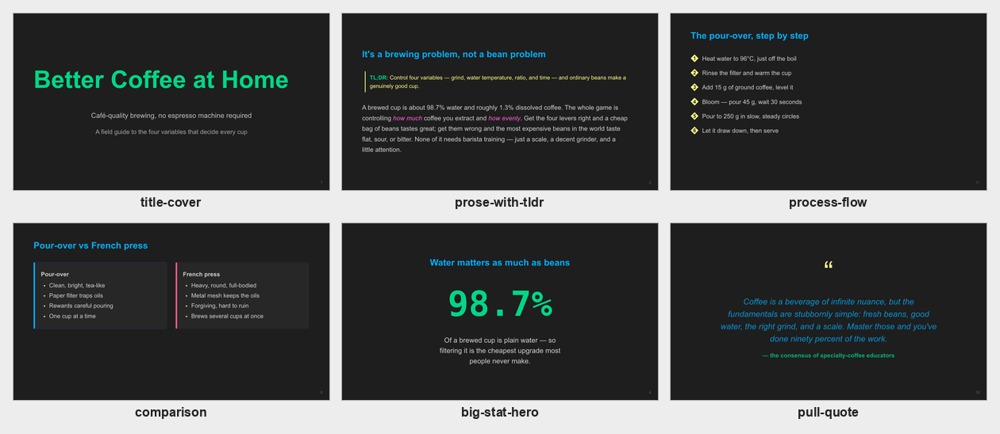
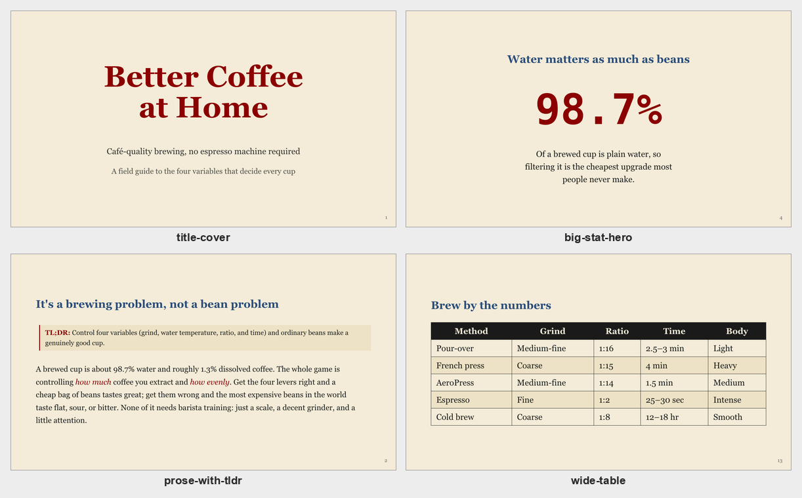
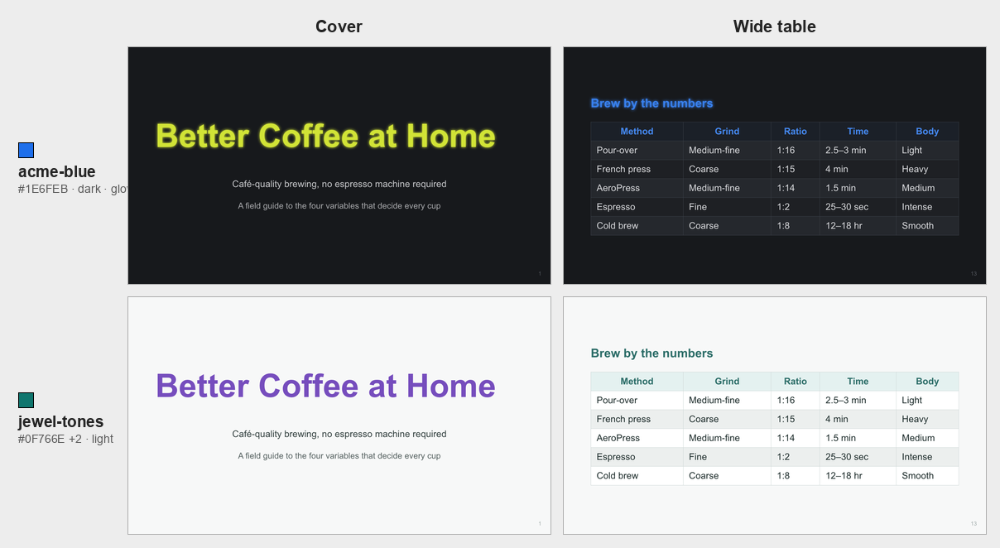

# Marpsmith

A bundle of agent skills for building Marp slide decks from plain markdown — layout engine, theme tooling, and an accessibility auditor.

## What's included

| Skill | What it does |
|---|---|
| **marp-slides** | Content-markdown → Marp deck with content-shape-aware layout selection (13-layout taxonomy), preset interchangeable themes, and `lint` / `auto-fit` / `check-slides` scripts. The engine the others orbit. |
| **deck-a11y-audit** | WCAG 2.1 contrast + colorblind + presentation-distance audit of a deck or theme CSS. |
| **theme-generator** | Brand color(s) → new Marp theme CSS on the var-based interchangeable contract. |

`marp-slides` picks each slide's layout from its content shape — one deck spans many of the 13 layouts (shown here in the `dark` preset):



For a one-slide-per-layout reference of the full taxonomy, see the catalog at [`skills/marp-slides/example.md`](skills/marp-slides/example.md).

## Requirements

- **Node.js** ≥ 18 — for the `marp-slides` scripts, `deck-a11y-audit`, and `theme-generator`.
- **Marp CLI** — `npm i -g @marp-team/marp-cli` (to render/preview decks).

## Install

Clone the repo and copy each skill folder into the skills directory used by your agent harness. Then install the helper-script dependencies in the copied `marp-slides/scripts/` folder.

```bash
git clone https://github.com/RanaCM/marpsmith.git
cd marpsmith

SKILLS=/path/to/your/skills    # your harness's skills directory
cp -r skills/* "$SKILLS"/
( cd "$SKILLS/marp-slides/scripts" && npm install )   # headless Chrome for auto-fit / check-slides
npm i -g @marp-team/marp-cli                          # render / preview decks (global)
```

Marpsmith is a skill bundle, not a standalone CLI. The Node scripts are helper tools that agents run from inside the skills.

## Install on claude.ai

Pre-built per-skill zips are attached to each [GitHub Release](https://github.com/RanaCM/marpsmith/releases). claude.ai installs **one skill per zip**, so upload each one separately:

1. Download the skill zips you want from the [latest release](https://github.com/RanaCM/marpsmith/releases/latest) (`marp-slides.zip`, `theme-generator.zip`, `deck-a11y-audit.zip`). Optionally verify them against `SHA256SUMS.txt`.
2. In claude.ai, go to **Customize** and upload each zip. claude.ai does not accept a combined multi-skill archive, so add them one at a time.

Requires code execution enabled.

Note: `marp-slides` ships without `node_modules` (consumers run `npm install` in `marp-slides/scripts`). The claude.ai sandbox's network access varies, so the Node helper scripts (`lint` / `auto-fit` / `check-slides`) may not install there; the layout and theme guidance in `SKILL.md` works regardless.

To confirm the helper scripts (and their headless Chrome) installed correctly:

```bash
node "$SKILLS/marp-slides/scripts/check-slides.mjs" examples/coffee-brewing.deck.md --theme "$SKILLS/marp-slides/themes/newspaper.css"
```

## Example: report → deck

`examples/` holds a complete end-to-end demo on a generic topic (home coffee brewing):

- **[`coffee-brewing.md`](examples/coffee-brewing.md)** — a plain report-style briefing (the input).
- **[`coffee-brewing.deck.md`](examples/coffee-brewing.deck.md)** — the Marp deck `marp-slides` produces from it, one slide per content shape. It exercises **all 14 layouts** in the taxonomy.

To produce a deck from a source like this, prompt your agent (with the skills installed) to run `marp-slides` on the file:

```text
Use the marp-slides skill to turn examples/coffee-brewing.md into a Marp slide deck: pick each slide's layout from its content shape, set the theme to newspaper, and write it to examples/coffee-brewing.deck.md.
```

Four of the resulting layouts, rendered under the **newspaper** theme:



These skills lean on the agent's judgment on layout choice, distillation, etc., so output quality scales with the model.

Preview or render it from the repo root — the bundled `.marprc.yml` registers the themes, so no `--theme-set` is needed:

```bash
marp --preview examples/coffee-brewing.deck.md                      # live preview
marp --html -o coffee-brewing.html examples/coffee-brewing.deck.md  # render to HTML
```

`--allow-local-files` isn't needed for preview or HTML — add it only when **exporting to PDF / PPTX / image**, so the local photo on the image-led slide loads.

`examples/` ships its own `.marprc.yml` too, so the same commands work from inside that folder. The `image-led` slide pulls `examples/assets/coffee-pour-over.jpg` — swap in your own photo to change it.

## Interchangeable themes

Marpsmith includes preset themes that share a CSS-var-based layout contract: a deck markdown renders correctly under any compatible theme; switching is purely the `theme:` line in frontmatter.

You can also create your own theme with `theme-generator`, then register the generated CSS in `.marprc.yml` under `themeSet:`.

Example prompts:

```text
Generate a Marp theme from brand color #1E6FEB. Use slug acme-blue, dark background, vivid accents, and write it to the marp-slides themes directory.
```

```text
Generate a Marp theme from these brand colors: #0F766E, #F59E0B, #7C3AED. Use slug jewel-tones, light background, muted accents, and make sure it follows the Marpsmith interchangeable-theme contract.
```

The two prompts above, rendered on the **same deck** — only the `theme:` line changes (the interchangeable-theme contract). Left column is the cover, right is a content table:



## Accessibility audit

`deck-a11y-audit` checks a finished deck **or** a theme CSS for accessibility — WCAG 2.1 / APCA contrast, color-blind safety, presentation-distance text size, heading hierarchy, and reliance on color alone. It runs on demand; reach for it when a deck will be presented or shared.

Prompt your agent:

```text
Run an accessibility audit on examples/coffee-brewing.deck.md under the newspaper theme — check WCAG contrast and colorblind safety, and flag anything that fails.
```

Or run the bundled theme auditor directly on any theme CSS:

```bash
node "$SKILLS/deck-a11y-audit/scripts/audit-theme.mjs" "$SKILLS/marp-slides/themes/newspaper.css"
```

It prints a per-pair report plus a severity summary:

```text
Theme: newspaper
Pairs audited: 20
Findings: 0 (0 HIGH, 0 MED, 0 LOW)

[ OK ] headings (h1-h6): #2a4d7c on #f4ecd8 — WCAG 7.28:1 (AAA), APCA Lc -78 (AAA)
[ OK ] em emphasis: #8b0000 on #f4ecd8 — WCAG 8.50:1 (AAA), APCA Lc -80 (AA)
[ OK ] table header: #f4ecd8 on #1a1a1a — WCAG 14.78:1 (AAA), APCA Lc 94 (AAA)
…
```
